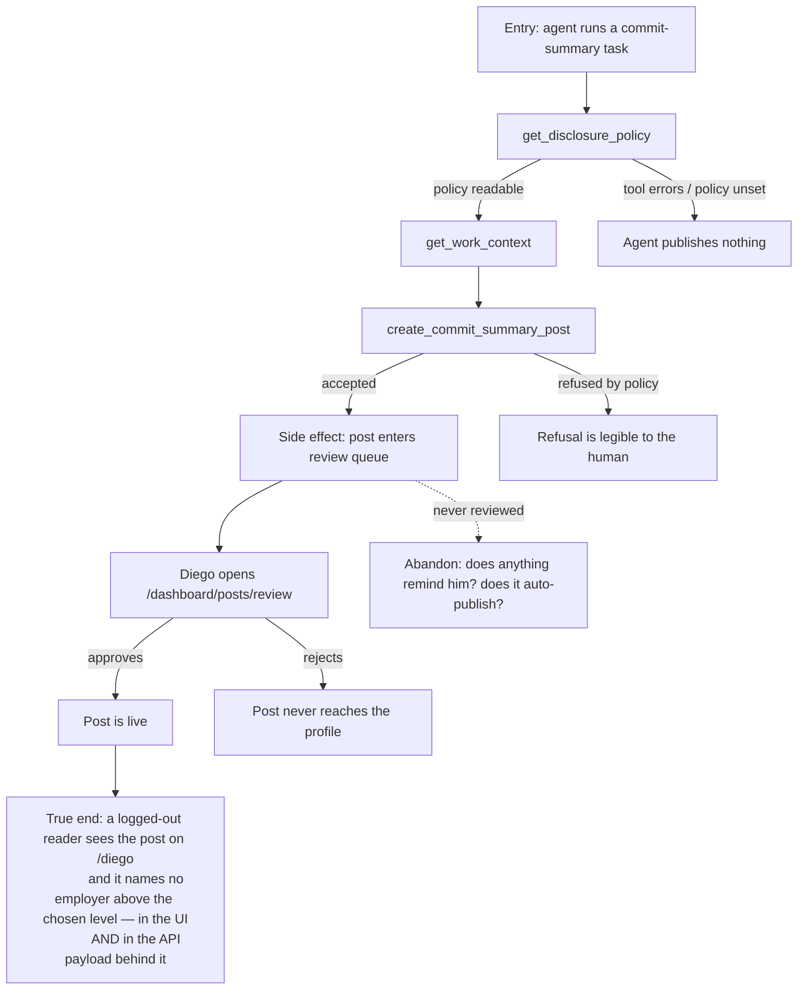

# Journeys and Flows

A journey is a sequence of user actions that delivers a specific value. Real-user QA targets journeys, not features: a feature can work in isolation while the journey it lives in is broken — and the breakage lives *between* the pages, exactly where page-level checks never look.

**The rule: flows before matrix.** No scenario exists until its journey is mapped as a flowchart. Scenarios derived by walking a flow test what a user lives through; scenarios invented from a feature list test what a developer built.

## Contents

- Why journeys instead of features
- Journey anatomy
- Mapping the flow (Mermaid)
- The true end state
- Identifying high-value journeys
- The CraftHub journey seed set
- Journey file format
- Abandonment paths
- Cross-surface journeys
- Deriving scenarios from a flow
- Anti-patterns

## Why journeys instead of features

> "Think about the high-value interactions users will have with your application. Try to come up with user journeys that define the core value of your product." — Martin Fowler, *The Practical Test Pyramid*

A feature is a unit of engineering. A journey is a unit of value. Feature-level QA answers *"does the drag handle work?"*; journey-level QA answers *"can someone actually turn a PDF into a profile they'd put in their bio?"*.

## Journey anatomy

```
[entry] → [actions] → [goal] → [exit]
              ↓
        [branches & abandonment]
```

- **Entry** — how the user arrives: the auth screen, a dashboard nav item, a profile link pasted into a chat, an MCP tool call, a git hook firing.
- **Actions** — the interaction sequence; each action has an expected immediate observable.
- **Goal** — the value delivered. Not "post created" — *"the post is live on the public profile, and it says nothing the policy forbids"*.
- **Exit** — what happens after the goal: where the user lands, what they receive. The journey ends when the user leaves satisfied, not when the request returns 200.
- **Branches & abandonment** — every place the user can pause, choose differently, hit an error, or walk away and resume later.

## Mapping the flow (Mermaid)

Every journey file carries a `flowchart` that makes the anatomy visual and derivable. The flowchart MUST cover:

- the entry point(s),
- each user action as a node,
- **branch points**: validation error, empty state, permission denied, policy refusal, concurrent-edit conflict,
- **side effects** as explicit nodes: embeddings generated, jobs enqueued on BullMQ, posts entering the review queue, a profile becoming publicly readable,
- the **true end state** (below), and at least one abandonment path.



A side effect is not verified when it fires — it is verified when it lands correctly: *"a post was created"* is not a pass; the right content, on the right profile, readable by the right audience, redacted on every surface, is.

## The true end state

The most common way QA lies is by stopping at the action. The flow's terminal node is where the user's value is confirmed:

- After a resume import: the parsed roles and dates are re-read from a fresh load and match the PDF — not the optimistic preview.
- After a layout rearrangement: the arrangement survives F5, and the mobile arrangement agrees with what the desktop one promised.
- After an agent publishes: a **logged-out** reader sees the post on the public profile, and the raw API payload behind that page carries the same redaction the UI showed.
- After a recruiter search: the same job description searched twice gives a stable ranking, and the number next to each candidate means something the recruiter could defend.

If the flowchart's last node is a button click or a `200 OK`, the flow is not finished being mapped.

## Identifying high-value journeys

For release cycles, pick 3-7 journeys by risk:

- **What can hurt a real person?** (an agent publishing above the disclosure level — this ranks first in this product, ahead of everything below)
- **What handles sensitive data?** (auth, API tokens, git connections, the work context an agent can read)
- **What's the first impression?** (sign-up → resume import → first public profile)
- **What's the product's verb?** (search by job description; arrange; publish)
- **What's used most frequently?** (the review queue, for anyone with an agent connected)
- **What's the recovery path?** (a failed import, an expired session mid-edit, a leak that is already public)

For branch/PR cycles, scope by the diff instead: every user-visible change maps to the journey(s) it touches — new flows get mapped, touched flows get updated. A diff confined to `apps/mcp` or `apps/extractor` is still user-visible; it maps to the agent journeys.

## The CraftHub journey seed set

Start here and adapt; these are the value paths the product exists to deliver. Ids are content-addressed slugs.

| Journey | Value statement | Primary persona | Entry |
|---|---|---|---|
| `J-sign-up-first-profile` | A developer goes from nothing to a shareable profile | Nina (New User) | `/` |
| `J-import-resume-pdf` | A PDF becomes a structured, correct career history | Nina | `/dashboard`, import |
| `J-arrange-profile-blocks` | The profile says what its owner wants, in the order they chose, on both desktop and mobile | Diego (Power User) | `/dashboard/layout` |
| `J-share-public-profile` | A stranger with a link learns enough in 30 seconds, signed out, on a phone | Sam (Mobile / cold reader) | `/<username>` |
| `J-recruiter-search-by-jd` | A pasted job description produces a shortlist a recruiter can act on | Priya (Recruiter) | `/dashboard/search` |
| `J-agent-publishes-post` | An agent tells the world what its human built — and nothing more | Atlas (Agent) | MCP `create_post` |
| `J-review-agent-post` | The human stays in the loop before anything goes public | Diego | `/dashboard/posts/review` |
| `J-set-disclosure-policy` | The user decides what may be said about their employers, and it holds | Diego | `/dashboard/settings` |
| `J-connect-agent-tooling` | An API token and a git connection let an agent publish as this user, and only as this user | Diego | `/dashboard/settings` |
| `J-recover-after-leak` | Something was published that shouldn't have been — can it be taken back? | Recovering User | `/dashboard/posts` |

`J-set-disclosure-policy` and `J-agent-publishes-post` are **cross-surface by construction** and get regression priority every cycle (see below).

## Journey file format

One file per journey at `<qa-docs-path>/journeys/J-<slug>.md` — the id is the content-addressed slug (2-5 kebab-case words naming the value, e.g. `J-import-resume-pdf`), never a sequence number. The Mermaid flowchart first, then the YAML map:

```yaml
journey:
  id: J-<slug>
  name: <verb-noun, e.g. "Import a resume into a profile">
  value_statement: "<what the user gains when this succeeds>"
  personas: [<primary persona>, <secondary persona>]
  entry_points:
    - url: <URL, deep link, MCP tool name, or CLI verb>
      origin: <direct | in-app-nav | shared-link | mcp-tool | git-hook | oauth-callback>
  actions:
    - step: 1
      verb: <what the user does, in user language>
      expected_observable: <what they should see within 3 seconds>
    - step: 2
  goal:
    observable: <the exact state that proves success>
    side_effects: [embedding-generated, job-enqueued, post-in-review-queue, profile-public]
  true_end_state: <the post-goal confirmation, incl. side-effect landing and the logged-out read>
  themes: [light, dark]
  exit:
    natural: <where the user lands after success>
  abandonment:
    - at_step: <N>
      how: <the realistic way a user gives up here>
      resume: <what happens when they come back>
  crosses: [<surfaces/services this journey spans — web, api, mcp, extractor, openai, pgvector, bullmq>]
  disclosure_relevant: <yes | no — yes for anything that can reach a public surface>
```

`themes` and `disclosure_relevant` are CraftHub additions and are not optional: a journey that renders UI declares both themes, and a journey that can reach a public surface declares its disclosure relevance so Step 7's completeness check can find it.

## Abandonment paths

A journey map without abort paths cannot find the bugs that matter. For "Import a resume into a profile":

- **Aborted-A:** upload → the LLM parse takes 40 seconds → close the tab (is the upload preserved, or is the profile now half-imported?).
- **Aborted-B:** parse returns a career the user doesn't recognize → they try to fix it by importing a second PDF (does it merge, replace, or duplicate?).
- **Aborted-C:** session expires mid-edit → return tomorrow → resume (continuity).

For "An agent publishes a post":

- **Aborted-D:** the post sits in the review queue and is never reviewed. Does it auto-publish after a while? Does anything tell the human it's waiting? Silence here is a design answer worth confirming, not assuming.

Abort paths surface the highest-impact bugs: lost work, duplicated careers, and posts that went live because nobody said no.

## Cross-surface journeys

Journeys crossing service boundaries get regression priority — no single test watches the whole contract. In CraftHub, these are the ones:

- **Disclosure enforcement** crosses settings UI → API → the MCP tool layer → the stored post → the public profile renderer → the public API payload. The settings test passes while the journey leaks. Mark `crosses: [web, api, mcp]` and walk it every cycle.
- **Recruiter search** crosses the JD input → embedding provider → pgvector query → the in-browser TF.js re-rank. Half of it runs on a server and half in the recruiter's laptop, and only the journey sees both.
- **The extractor** crosses a local git repository → hashed activity → the API → the agent's work context. A change at either end is invisible to the other's tests.

`@repo/schemas` is the contract that binds most of these; a scenario whose failure mode is "the shape drifted" should be pinned by a contract test rather than re-walked forever (`references/automation-backlog.md`).

## Deriving scenarios from a flow

Walk the flowchart node by node and edge by edge:

1. The happy path end-to-end (entry → true end state) = one scenario.
2. Each branch point (validation error, empty, denied, policy refusal) = one scenario if a real persona plausibly hits it.
3. Each abandonment path with its resume = one scenario.
4. Each side effect's landing (the post as a logged-out reader sees it, the embedding actually influencing the ranking) = one scenario.
5. **Each public surface a disclosure-relevant journey can reach** = one scenario, because redaction that holds in one place and not another is the defining bug of this product.
6. Cross-check the six taxonomy dimensions (routed at Step 4 of the SKILL) for what walking the boxes doesn't reveal — experiential, theme and cross-cutting concerns don't appear as nodes.

Each derived scenario becomes one scenario file (schema routed at Step 4 of the SKILL). If a flow yields more than ~10 scenarios, the journey is probably two journeys — split it.

## Anti-patterns

- **Matrix before flows** — enumerating checks from the diff's file list produces page tests. Map the flow first; derive from it.
- **Goal = "click submit"** — rewrite until the goal is something the user wanted, not something the system received.
- **Feature-named journeys** — "Settings page test" is a feature test mislabeled. Rename after the value: "Decide what an agent may say about my employer, and have it hold".
- **No abandonment path** — mandatory, at least one per journey.
- **Side effects as afterthoughts** — if the review queue, the public render and the API payload aren't nodes in the flow, they will not be verified at their landing.
- **Stopping the agent journey at the tool response** — `create_post` returning success is the least interesting node in that flowchart.
- **Step-by-step click recordings** — a journey is user-language verbs, not a Playwright script. (The script comes later, from the automation backlog.)
